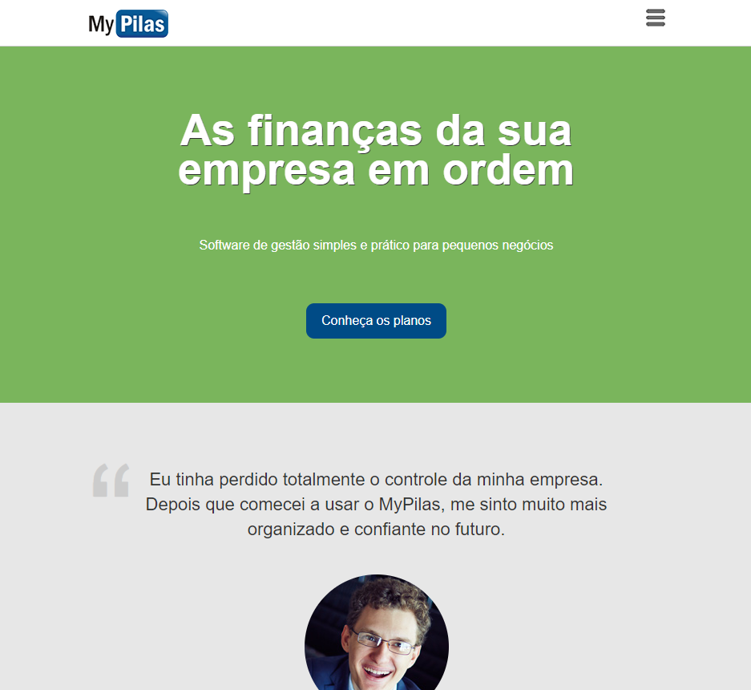

# MyPilas

> Curso Web Design Responsivo

O Mypilas é um projeto fictício de uma empresa que tem um software de gestão de finanças para pequenas empresas. O site foi desenvolvido no curso Web Design Responsivo da AlgaWorks.

[🔗 Clique aqui para acessar](https://maritanaalves.github.io/projeto-mypilas/)

## 🔧 Tecnologias

-HTML
-CSS
-JavaScript
-Bootstrap
-Git e Github

## ❤️ Contato

maritana.cz@gmail.com
